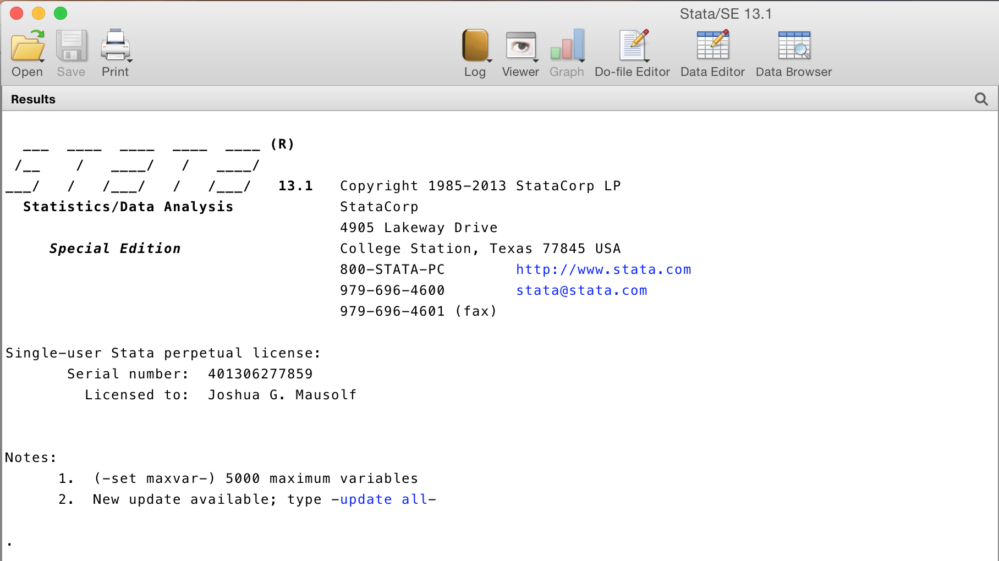
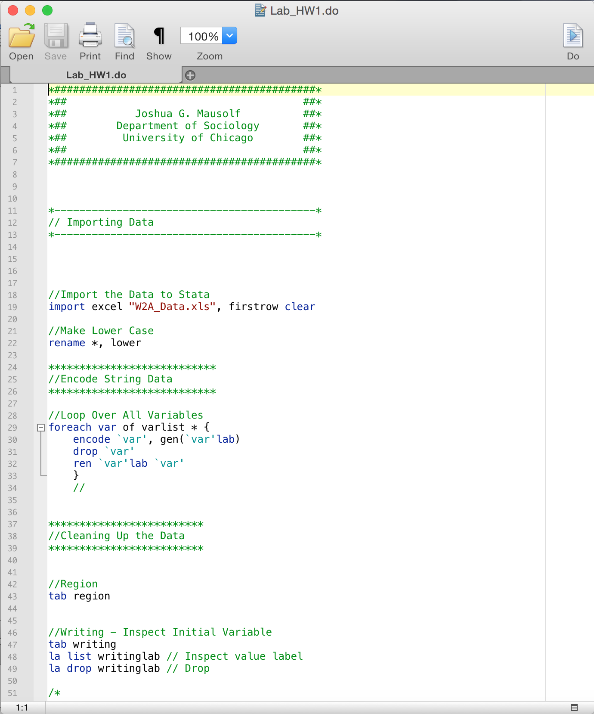
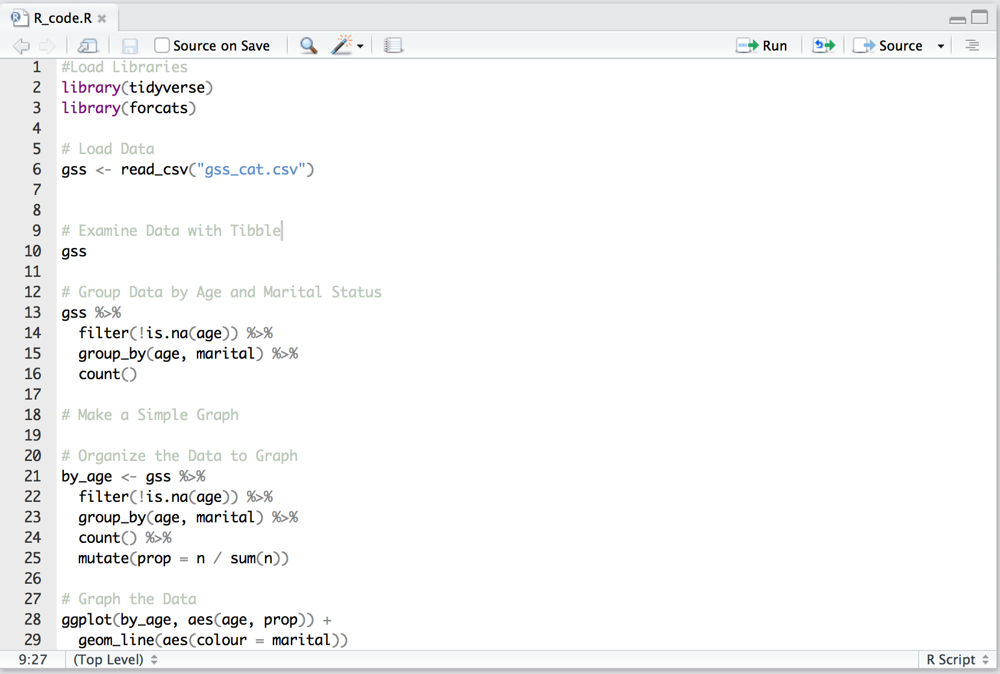

```{r setup, include=FALSE}
knitr::opts_chunk$set(cache=TRUE)
```


# Setup

In today's session, we will be discussing an introduction to two statistical programming languages, R and Stata. First, we will review the setup and access to these programs:

* [Setup for R](./setup_R.html)
* [Setup for Stata](./setup_Stata.html)


# Workflow and Basics

## Performing Analysis: The Console (Don't Do It)

Regardless of which program you prefer to use, there are some basics that apply to both programs. First, both programs have a "console" where you can enter commands. In general, do not perform analysis with the console or by using "point and click" menus in Stata. 

For both programs you want to be able to have a reproducible workflow. Say you work for hours on an analysis and need to change a step at the beginning, or use updated data. Do you remember every step you did over the last several hours? What if you wait two weeks or two months? To reproduce research and ensure you have taken the correct steps, use scripts:

## Using Scripts or Code

Although this may sound intimidating, using scripts or code is a simple way to perform the analysis step by step, document those steps, and be able to reproduce it in moments. In both cases, the script is similar to a raw text file with specific file extensions for R and Stata.  In Stata, your code (and comments) are written in a file known as a ".do file." These files have an extension ".do". In R, you will use either an RScript (.R file) or an RMarkdown file (.Rmd). Like an RScript, a RMarkdown file will contain not only your code but also your written analysis, graphs, and images. Essentially, you can write papers or articles with statistical analysis all in one cohesive document. 

### Opening a .do file in Stata

To open a new .do file in Stata, click the .do file icon:



<br>

This will open a blank .do file, that you can use to write your steps. Below is an example .do file:

<br>




### Opening a .Rscript (.R) file in RStudio

If you open RStudio, by default the top left window has a blank .RScript open. You can save this script with any name <filename.R>. An example .RScript image is below:



### Running the Code:

To run the code, there are two main ways. You can run part of the code by highlighting the desired line or lines. In Stata (on Mac), type "`Command`"+"`Shift`"+"`D`". In R, type "`Command`"+"`Enter`". 

To run all the code: In Stata (on Mac), do not have any code highlighted and type "`Command`"+"`Shift`"+"`D`" or use "`Command`"+"`A`" and "`Command`"+"`Shift`"+"`D`". In R, type "`Command`"+"`Shift`"+"`S`" or use "`Command`"+"`A`" and "`Command`"+"`Enter`".

---


# Example Analysis:


## Example in R:

```{r, message=FALSE, warning=FALSE}
#Load Libraries
library(tidyverse)
library(forcats)

# Load Data
gss <- read_csv("example_code/gss_cat.csv")


# Examine Data with Tibble
gss

# Group Data by Age and Marital Status
gss %>%
  filter(!is.na(age)) %>%
  group_by(age, marital) %>%
  count()

# Make a Simple Graph

# Organize the Data to Graph
by_age <- gss %>%
  filter(!is.na(age)) %>%
  group_by(age, marital) %>%
  count() %>%
  mutate(prop = n / sum(n))

# Graph the Data
ggplot(by_age, aes(age, prop)) +
  geom_line(aes(colour = marital))

```

## Example in Stata

The [.do file can be accessed here](example_code/stata_code.do)

```
*##########################################*
*##                                      ##*
*##           Joshua G. Mausolf          ##*
*##        Department of Sociology       ##*
*##         University of Chicago        ##*
*##                                      ##*
*##########################################*


//Load Your Data By Double Clicking It
use "gss_2006_example.dta", clear


*------------------------------------------*
// Examine the Data
*------------------------------------------*

//Describe All Data
describe

//Codebook All Data
codebook

//Summarize All Data
sum

//Summarize All Data with Detail
sum, detail

//List Data in First 10 Rows
list in 1/10

//List All Value Labels
label dir


*------------------------------------------*
// Cross Tabs
*------------------------------------------*

//Example - 1
tab sex marital, col

//Example - 2
tab wrkwayup race, col

//Example - 3
//Same as Example 2, but Igore DK and Other
tab wrkwayup race if wrkwayup<=5 & race<=2, col


*------------------------------------------*
// Statistical Tests 
*------------------------------------------*

//Chi 2
//For Two Categorical Variables, Do A Chi2 Test
tab wrkwayup race if wrkwayup<=5 & race<=2, col chi

//What If We Only Consider Those < 30 Years Old
tab wrkwayup race if wrkwayup<=5 & race<=2 & age<30, col chi

//Or Those Older Than 50
tab wrkwayup race if wrkwayup<=5 & race<=2 & age>50, col chi


*------------------------------------------*
// Manipulate Data 
*------------------------------------------*

//GSS Codebook for Reference
//http://www.thearda.com/archive/files/Codebooks/GSS2006_CB.asp

//Start
tab wrkwayup

//Make New Variable
gen wrkwayup3 = wrkwayup
tab wrkwayup3

//Label Variable
label var wrkwayup3 "Blacks should overcome prejudice without favors"
tab wrkwayup3


//Apply Existing Value Label
label val wrkwayup3 wrkwayup
tab wrkwayup3


//Recode Variable Into 3 Groups
recode wrkwayup3 (1/2=1) (3=2) (4/5=3)
tab wrkwayup3

//Define New Label
la de wrkwayup3lab 1 "Agree" 2 "Neutral" 3 "Disagree" 8 "Don't know"
la val wrkwayup3 wrkwayup3lab
tab wrkwayup3


*------------------------------------------*
// Graphs
*------------------------------------------*

//Very Simple Box Graph
graph box educ if educ<98, over(race) yline(12) 

//Simple Scatter with Trend Lines
twoway (scatter age educ if educ<98) (lfit age educ if educ<98)


//Histogram - Basic
hist wrkwayup3, by(race)

```